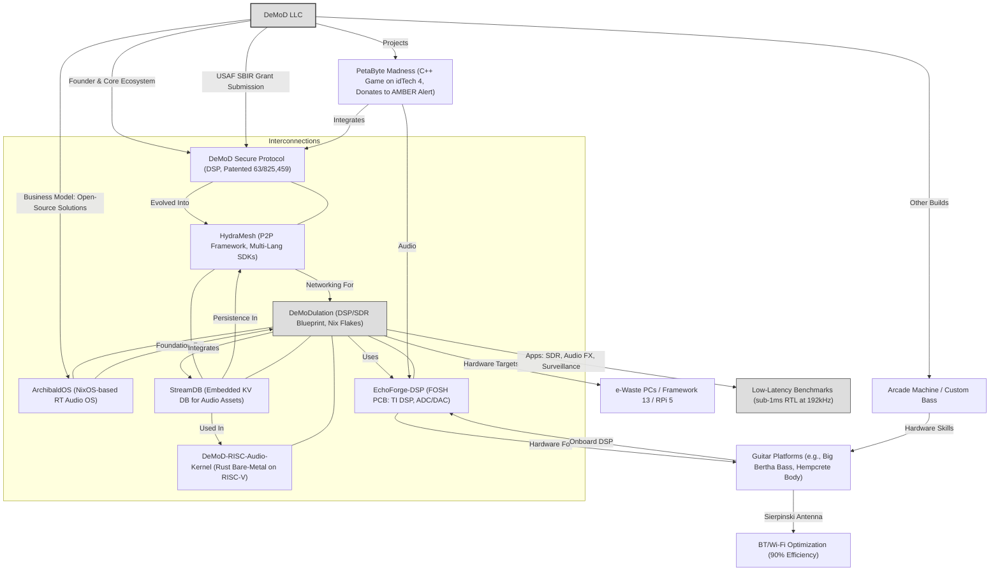

```
  ___   _      _   _   ___  ____________          ______    ___  ___     ______   _      _     _____ 
 / _ \ | |    | | | | /   ||___  /___  /          |  _  \   |  \/  |     |  _  \ | |    | |   /  __ \
/ /_\ \| |    | |_| |/ /| |   / /   / /   ______  | | | |___| .  . | ___ | | | | | |    | |   | /  \/
|  _  || |    |  _  / /_| |  / /   / /   |______| | | | / _ \ |\/| |/ _ \| | | | | |    | |   | |    
| | | || |____| | | \___  |./ /  ./ /             | |/ /  __/ |  | | (_) | |/ /  | |____| |___| \__/\
\_| |_/\_____/\_| |_/   |_/\_/   \_/              |___/ \___\_|  |_/\___/|___/   \_____/\_____/\____/
```
Being opinionated about your tools, the entities that exist solely to provide a means to an end. Is not a lost cause for many reasons, they are the conduit of your creativity. There are many artisans in history and modern times who make their own tools. The best example of this is the Blacksmith.

They build each tool they need for their unique desires. Specifically forged for their art, which may even be the tool itself. My point is that each variable in your cocktail of creation will define the result of a fine imprint that creates its character and soul. So continue to be an opinionated ass, its your obligation as a creator. Make your own tools if needed, but there is no shame in using what others have built.
This can actually lead to improvements on these legacy FOSS applications. The beauty of FOSS or OSS is that you can modify it to your needs. My goals with DeMoD have been this from the beginning, giving the creator the tools to build what they need. A lot of my work appears tangential and scatterbrained, if you consider everything I have done in detail. It all connects to itself, constantly referring to itself for a self fulfilling ecosystem.

My love for Open Source has inspired my business model, I plan to create many open source solutions for many use cases.
Every artist deserves to make their tool a work of art. People like Les Paul, Terry Davis, and Van Halen understood this as well. Those are the first few that come to mind but there are many more examples. There is a reason why every good luthier takes great pride in what they do.
Be opinionated, it defines who you are and how you create. If you cannot find your needs, then make them, obsess over the necessary tools for the job. This is how invention comes to fruition.



## performance & metrics for nerds

 
## Projects I endorse


